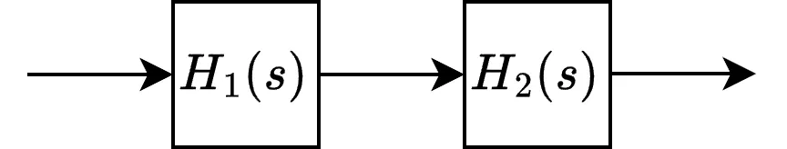
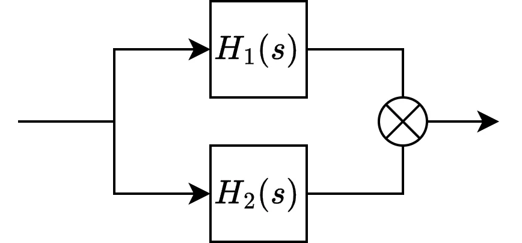
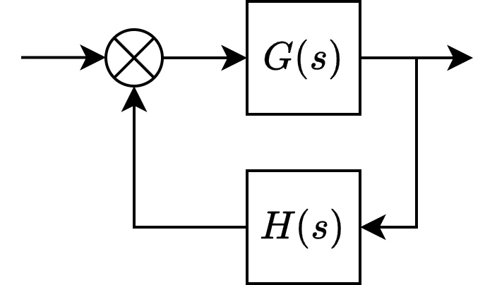
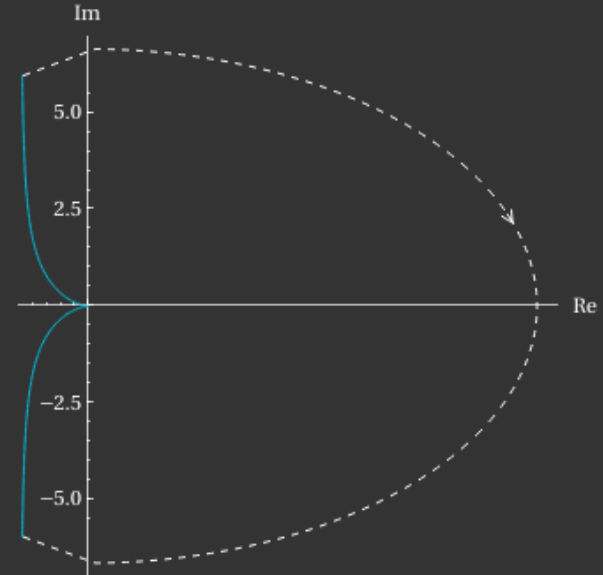

# 传递函数

我们将经常碰到可以描述为线性时不变系统（LTI）的组件，即：

- 输入与输出是线性关系
    - $f(x+y) = f(x) + f(y)$
    - $f(a \times x) = a \times f(x)$
- 时不变性
    - $x(t) \rightarrow y(t), x(t+a) \rightarrow y(t+a)$

对于这样的系统，我们可以使用传递函数将其描述为与频率相关的输入输出关系：

$$
H(s) = \frac{Y(s)}{X(s)} = \frac{N(s)}{D(s)}
$$

其中：

- $s = \sigma + j\omega$

    > 也常作为 $j\omega$ 或 $\omega$

- $Y(s)$：随 $s$ 变化的输出函数
- $X(s)$：随 $s$ 变化的输入函数
- $N(s)$：分子多项式
- $D{s}$：分母多项式
- $G$：不随频率变化的常增益

在电路分析中，$Y$ 和 $X$ 可以用来指代电压/电流等各种值。

传递函数经常会被用于分析系统的稳定性。关于稳定的定义有多种说法，在此处我们将其定义为：

- 始终可以保持 LTI 系统特性的传递函数即稳定。

在 $X(s) = 0$ 或 $D(s) = 0$ 时，如果 $\omega \ge 0$，那么就可能会出现 $|H(s)| = +\infty$ 的情况；这一现象显然违反了 LTI 的特性，代表函数出现了不稳定。
> $X(s) = 0$ 或 $D(s) = 0$ 也被称为`特征函数`，可用于判断函数的稳定性。

## 常用特征

- 零点（zero）：当 $H(s) = 0$ 时，$s$ 的值为传递函数的零点

- 极点（pole）：当 $|H(s)| = +\infty$ 时，$s$ 的值为传递函数的极点

- 幅值：$|H(s)|$

    > 常用变换：$|\frac{1}{a+jb}| = \frac{1}{\sqrt{a^2+b^2}}$

- 相位：$Arg(H(s))$

    > 常用变换：$Arg(\frac{1}{a+jb}) = -\arctan\frac{b}{a}$

## 传递函数的组合

### 串联

<figure markdown>
{ width="400" loading=lazy }
</figure>

$$
H(s) = H_{1}(s) \times H_{2}(s)
$$

### 并联

<figure markdown>
{ width="400" loading=lazy }
</figure>

$$
H(s) = H_{1}(s) \pm H_{2}(s)
$$

### 反馈

> 又称闭环传递函数

<figure markdown>
{ width="400" loading=lazy }
</figure>

$$
H_{L}(s) = \frac{G(s)}{1 \mp G(s)H(s)}
$$

- $G(s)H(s)$ 被称为开环传递函数
- 正反馈为负号（$-$），负反馈为正号（$+$）
- 通常只使用负反馈，因此特征函数部分常被简写为 $1 + G(s)H(s)$

## 常用图表

### 伯德图/波特图（Bode plot）

/// admonition | 注意
    type: warning

伯德图在工程上的使用较多，但并不能作为稳定性的绝对判断依据，需使用奈奎斯特图。

///

即增益与相位分别随频率变化的图表，常使用半对数坐标图（频率横轴为对数，纵轴为线性）进行表示，增益单位为分贝，相位单位为角度。

> 增益 $G_{dB} = 20 \log_{10} |H(s)|$

### 奈奎斯特图（Nyquist plot）

在极坐标上同时包含增益和相位信息的图表，横轴为实部，纵轴为虚部。以 $\omega = 0 \to +\infty$ 为顺序，归一化增益为长度，相位为角度进行描点，然后将点按顺序连起来，并按描点顺序标记线条方向。最后将线按照实轴翻转（表示 $\omega \le 0$ 范围），就变成了完整的奈奎斯特图。

该图表可以通过奈奎斯特稳定性判据来获知闭环系统的稳定性，本质上是将奈奎斯特图映射到了沿 $(0, -\infty j)$，$(0, +\infty j)$ 到 $(+\infty, 0)$ 形成的被称为奈奎斯特围道的大半圆上，并利用辐角原理判断闭环特征函数的极点数量：

对于闭环传递函数，其特征函数为 $1 + G(s)H(s) = 0$：

- 画出开环传递函数 $G(s)H(s)$ 的奈奎斯特图
- 标记 $(-1, 0j)$ 这一个点
    > 该点代表增益为 1，相位相反
- 数一下线条绕过了多少次该点，并设一个数 $N=0$，顺时针绕一次就 $+1$，逆时针 $-1$
    - 如果穿过该点，则无法判断稳定性
- 标记 $G(s)H(s)$ 的所有极点，将落在奈奎斯特围道范围内（即正实轴范围）的数量记为 $P$

然后根据以下情况得出结论：
> $P + N$ 为闭环传递函数的正实部极点数量

- $P + N \neq 0$
    - 系统不稳定
- $P + N = 0$
    - 系统稳定

另外，在工程上，还可以额外在 $(-1, 0j)$ 这一点上画一个半径为 `0.766` 的圆（代表 $45°$ [相位裕度](/03_components/03_amplifier/02_stability.md) 和 12dB 增益裕度，低于就易不稳定），将这个圆的范围外称为`安全区`，并根据以下规则得出结论：

- 线条保持在安全区
    - 系统稳定
- 线条离开安全区
    - 系统可能不稳定

#### 极点位于虚轴

以该传递函数为例：

$$
H(s) = \frac{1}{s(s+1)}
$$

可见其有两个极点：$-1$ 和 $0$，这时需要修改奈奎斯特围道，在 $(0, 0)$ 这一位置从右侧绕一个半径近似 $0$ 的半圆，从而绕过该极点，使得围道范围内不存在极点（$P=0$）。

现在按正常方法画出除 $\omega = 0$ 外的奈奎斯特图，而 $\omega = 0$ 的图形为从奈奎斯特图 $\omega \to -0$ 该点射出，连接 $\omega \to +0$ 该点，半径为 $+\infty$ 的圆弧，方向为顺时针。

<figure markdown>
{ width="400" loading=lazy }
</figure>

根据图表，该传递函数的图形不绕过 $(-1, 0j)$，且围道内不存在极点，因此可判断为稳定。

#### 原点存在多个极点

对于原点存在多个极点的传递函数，其奈奎斯特图会多次绕过 $(-1, 0j)$，因此作为开环传递函数时皆不稳定，但在闭环中有可能稳定。

### 示例

/// marimo-embed
    height: 800px
    mode: read
    app_width: full

@app.cell
def ui():
    import marimo as mo
    import micropip

    # Install dependency
    await micropip.install('control')

    input_nums = mo.ui.text(value='1', label='分子多项式系数：')
    input_dens = mo.ui.text(value='1,1,0', label='分母多项式系数：')

    mo.vstack([input_nums, input_dens])

@app.cell
def plot():
    import control as ct

    def _str_to_list(input: str) -> list:
        """Convert coefficient string to list.

        Args:
            input (str): Coefficient string from input

        Returns:
            list: List of coefficients
        """
        out = input.split(',')

        for i, j in enumerate(out):
            out[i] = float(j.strip())

        return out

    def _list_to_poly(input: list) -> str:
        """Convert coefficient list to polynomial format.

        Args:
            input (list): Coefficient list

        Returns:
            str: Polynomial in latex format
        """
        mark = len(input)

        output = ''

        for i, j in enumerate(input):
            mark -= 1

            # Skip zeros
            if j == 0:
                continue

            if j > 0:
                output += '+'

            output += f'{j}s^' + '{' + f'{mark}' + '}'

        return output.removeprefix('+').removesuffix('s^{0}').replace('s^{1}', 's')

    nums = _str_to_list(input_nums.value)
    dens = _str_to_list(input_dens.value)

    func = ct.tf(_str_to_list(input_nums.value), _str_to_list(input_dens.value))

    mo.vstack(
        [
            mo.md('传递函数：' + r'$\frac{' + f'{_list_to_poly(nums)}' + '}{' + f'{_list_to_poly(dens)}' + '}$'),
            mo.md('伯德图：'),
            func.bode_plot().figure,
            mo.md('奈奎斯特图：'),
            func.nyquist_plot().figure,
        ]
    )

///

## 参考

- [Texas Instruments - Power Tips: How to Use Nyquist Plots to Assess System
Stability](https://www.ti.com/lit/ta/ssztae8/ssztae8.pdf)
- [MIT OpenCourseWare - Principles of Automatic Control: Lecture 20~22](https://ocw.mit.edu/courses/16-06-principles-of-automatic-control-fall-2012/)
- [MIT OpenCourseWare - Feedback Control Systems: Frequency response methods](https://ocw.mit.edu/courses/16-30-feedback-control-systems-fall-2010/ef34e49f4c79159fe0b1d8e1752bb8b5_MIT16_30F10_lec03.pdf)
- Alan V. Oppenheim, Alan S. Willsky, S. Hamid Nawab - Signals and Systems, Second Edition
- [Karl J. Åström, Richard M. Murray - FAQ: What does the Nyquist plot look like for a system with poles at the origin?](https://www.cds.caltech.edu/~murray/FBS/FAQ:_What_does_the_Nyquist_plot_look_like_for_a_system_with_poles_at_the_origin.html)
