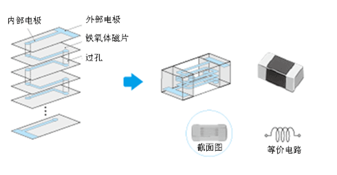
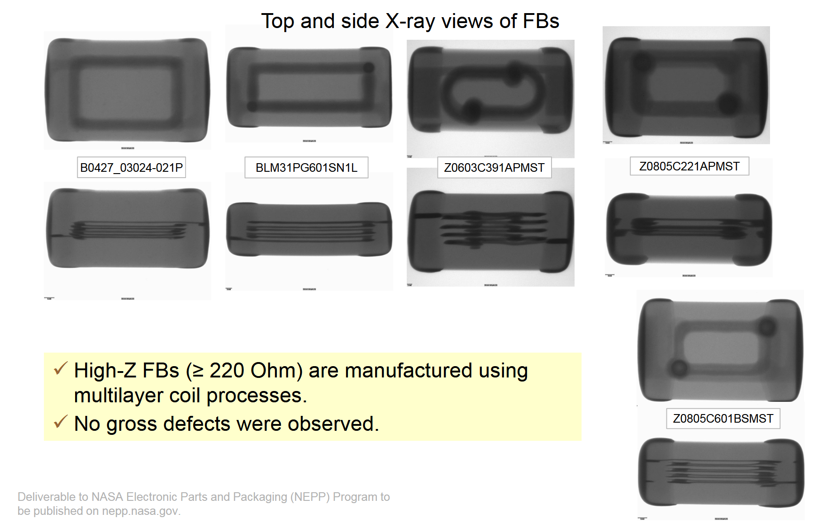
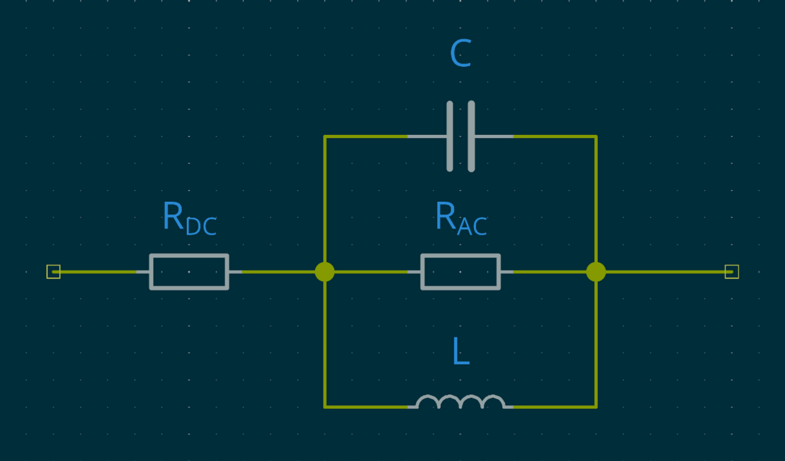
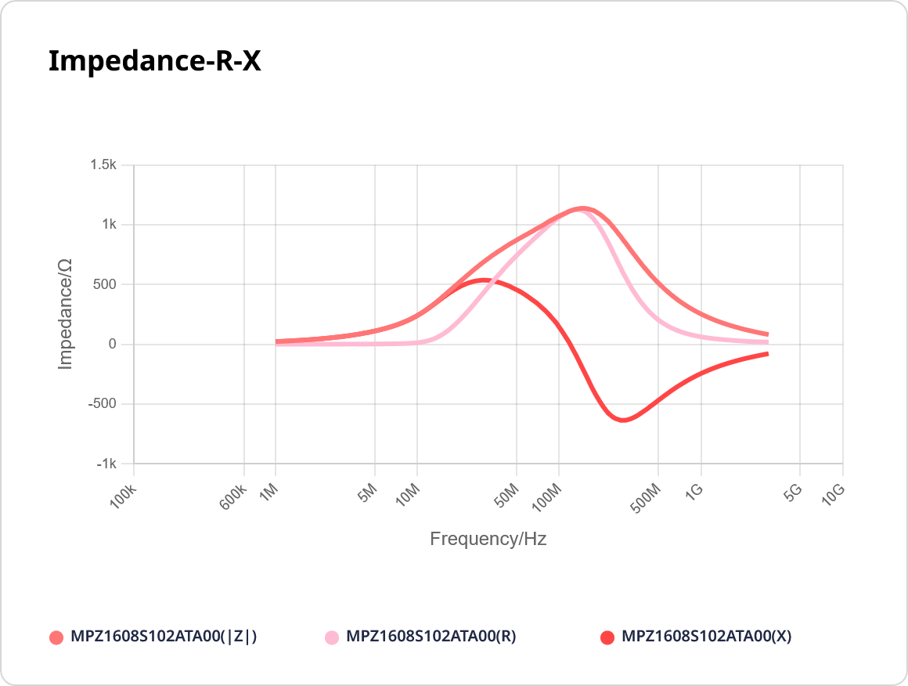
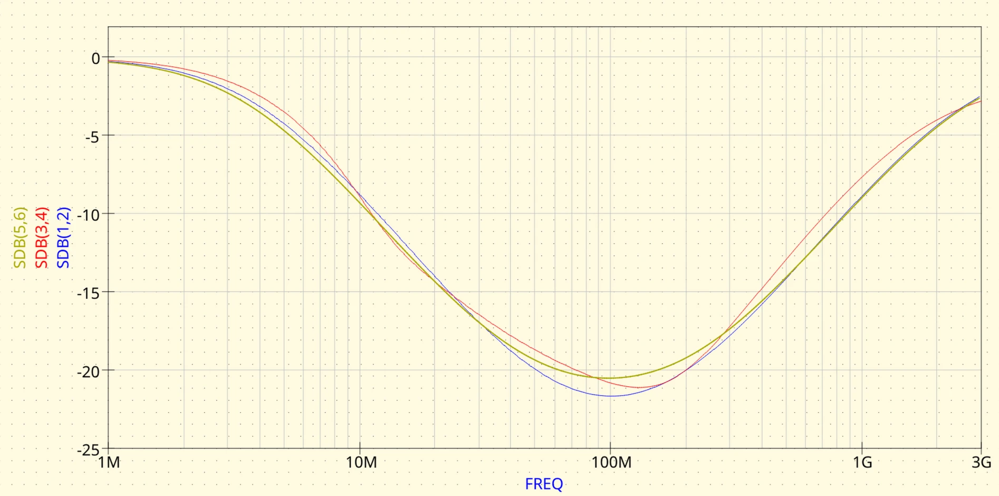
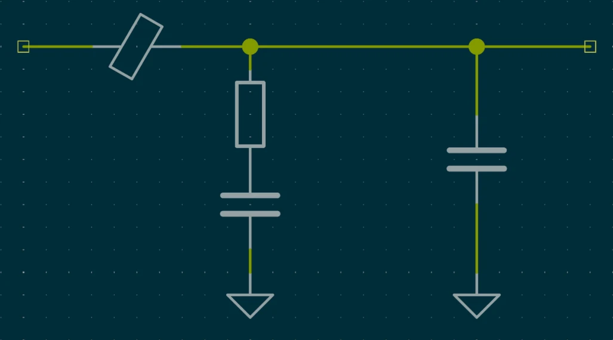

<!--
 Copyright 2026 ResRipper.
 SPDX-License-Identifier: Apache-2.0
-->

# 铁氧体磁珠

铁氧体磁珠（Ferrite Bead）常用于抑制电源和信号的噪声，形态包括：

- 线缆末端的圆柱形块
- 磁芯裸露的 PCB 插件
- 标准尺寸的片式铁氧体磁珠贴片

本文仅介绍贴片型磁珠。

## 原理

铁氧体磁珠由铁氧体制成的外部陶瓷材料，以及位于其内部的导体组成，可以认为是电感的一种。

<figure markdown>
{ width="400" loading=lazy }
{ width="400" loading=lazy }
</figure>

但其与普通电感不同的地方在于：

- 主要用于降低噪声并将其以热量形式耗散
- 电感值较低，不注重于能量存储能力

## 主要参数

### 阻抗

磁珠的参数表一般会提供特定频率（一般为 100MHz）下的阻抗值，更高的值代表对噪声更强的抑制能力，但不代表其最大阻抗值。

在选择磁珠时，需确保输入频段不在磁珠的滤波范围内，否则将可能出现以下情况：

- 对于数字信号，可能会在切换边缘出现震荡或影响最大切换频率
- 对于电流输入，可能会使磁珠发热增加，导致性能下降或烧毁

### 额定电流

磁珠的载流能力存在限制，在大电流下，会出现两种影响：

1. 发热，甚至造成内部熔断
2. 磁饱和，造成阻抗下降，并使得滤波能力下降和发热进一步提升

磁珠的额定电流代表了在指定温升情况下的持续电流大小，具体情况需参考图表。

磁珠的阻抗对输入电流非常敏感，在 50% 额定电流条件下，有些磁珠的阻抗甚至能下降到额定值的 10% 左右。为保证滤波效果，建议磁珠额定电流为输入电流的 5 倍以上。

## 模型

/// admonition | 注意项
    type: warning

- 在厂商提供了模型的情况下，请始终以其提供的模型为准，并注意其中定义的环境和测试条件
- 仿真无法替代实验测量

///

根据厂商提供的电阻-电抗-阻抗图表和直流电阻，我们可以使用非理想磁珠的简化模型进行仿真：

<figure markdown>
{ width="400" loading=lazy }
</figure>

以 [TDK MPZ1608S102ATA00](https://product.tdk.com/en/search/emc/emc/beads/info?part_no=MPZ1608S102ATA00) 为例：

<figure markdown>
{ width="400" loading=lazy }
</figure>

### 常用方法

#### 直流电阻

在直流电压下，模型中的电感短路，因此阻抗等于磁珠的直流电阻。根据数据表，可知其最大直流电阻为 $300m\Omega$ 。

#### 交流电阻

在 $X \approx 0\Omega$ 时，$Z = R_{AC}$，磁珠电阻值即模型中的交流电阻值。根据图表，可知该值 $R_{AC} \approx 1.112k\Omega$ 。

#### 寄生电感

在 $X \gt 0$ 时，磁珠带有感性。当 $Z \approx X = X_{L}$ 时，可通过以下公式得出寄生电感值：

$$
L = \frac{X_{L}}{2\pi f}
$$

在本文示例中，通过图表可知 $X_{L} \approx 233.8\Omega @9.794\text{MHz}$，得出寄生电感 $L \approx 3.799\text{uH}$ 。

#### 寄生电容

在 $X \lt 0$ 时，磁珠带有容性。当 $Z \approx |X| = X_{C}$ 时，可通过以下公式得出寄生电容值：

$$
C = \frac{1}{2\pi f X_{C}}
$$

在本文示例中，通过图表可知 $X_{C} \approx 99.107\Omega @2.456\text{GHz}$，得出寄生电容 $C \approx 0.654\text{pF}$ 。

### 替代方法

受测量设备限制，很多情况下图表会缺失右侧部分信息，无法直接读表填充数值。这时，可以使用以下比较复杂的方法计算各组件的参数：

根据简化模型电路，我们可以得出其阻抗公式：

$$
\begin{split}
    Z &= R_{DC} + R_{AC} || X_{C} || X_{L} \\
      &= R_{DC} + \frac{1}{1/R_{AC} + 1/j\omega L  + j\omega C}
\end{split}
$$

整理后得

$$
\frac{1}{Z - R_{DC}} = \frac{1}{R_{AC}} - j\frac{1}{\omega L} + j\omega C
$$

通过在图表中选取三个频率，即可构建一套三元一次方程组，理论上就能得出模型参数。但实际上，在不同频率取值计算出的参数偏差可能会非常大，导致仿真数据出现较大误差，因此仅建议将该方法作为最后手段使用。

对于示例使用的磁珠，可以找到以下三组值：

- $f = 10.195 \text{MHz}, Z = 14.316 + j258.288 \Omega$
- $f = 108.172 \text{MHz}, Z = 1089 + j82.669 \Omega$
- $f = 604.919 \text{MHz}, Z = 143.104 - j396.965 \Omega$

将得出的复数解取模后为 $R \approx 962.113\Omega$，$L \approx 4.07 \text{uH}$，$C \approx 0.646 \text{pF}$。

/// marimo-embed
    height: 800px
    mode: read
    include_code: false
    app_width: full

@app.cell
async def ui():

    import marimo as mo

    rdc = mo.ui.number(start=0, step=0.001)  # mOhm

    f_1 = mo.ui.number(start=0, step=0.001)  # MHz
    zr_1 = mo.ui.number(start=0, step=0.001)  # Ohm
    zx_1 = mo.ui.number(step=0.001)  # Ohm

    f_2 = mo.ui.number(start=0, step=0.001)  # MHz
    zr_2 = mo.ui.number(start=0, step=0.001)  # Ohm
    zx_2 = mo.ui.number(step=0.001)  # Ohm

    f_3 = mo.ui.number(start=0, step=0.001)  # MHz
    zr_3 = mo.ui.number(start=0, step=0.001)  # Ohm
    zx_3 = mo.ui.number(step=0.001)  # Ohm

    mo.vstack(
        [
            mo.md(f'R - DC: {rdc}' + r' m$\Omega$'),
            mo.md('Point 1:'),
            mo.md(f'F: {f_1} MHz'),
            mo.md(f'Z: {zr_1} + j {zx_1}' + r' $\Omega$'),
            mo.md('Point 2:'),
            mo.md(f'F: {f_2} MHz'),
            mo.md(f'Z: {zr_2} + j {zx_2}' + r' $\Omega$'),
            mo.md('Point 3:'),
            mo.md(f'F: {f_3} MHz'),
            mo.md(f'Z: {zr_3} + j {zx_3}' + r' $\Omega$'),
        ]
    )
    return f_1, f_2, f_3, rdc, zr_1, zr_2, zr_3, zx_1, zx_2, zx_3

@app.cell
def result():

    import numpy as np

    def comp_solver(f: list, rdc: float, zr: list, zx: list) -> list[float]:
        """Ferrite bead components value solver.

        Args:
            f (list): Frequecy list
            rdc (float): DC resistance
            zr (list): Impedance list - Resistance
            zx (list): Impedance list - Reactance
        """
        # Vars: 1/Rac, 1/L, C
        coff = [
            [1, -1j / (2 * np.pi * f[0]), 2j * np.pi * f[0]],
            [1, -1j / (2 * np.pi * f[1]), 2j * np.pi * f[1]],
            [1, -1j / (2 * np.pi * f[2]), 2j * np.pi * f[2]],
        ]
        z = [1 / (zr[0] + 1j * zx[0] - rdc), 1 / (zr[1] + 1j * zx[1] - rdc), 1 / (zr[2] + 1j * zx[2] - rdc)]

        x = np.linalg.solve(coff, z)

        return [np.abs(1 / x[0]), np.abs(1 / x[1]), np.abs(x[2])]

    result = comp_solver(
        [f_1.value * 1e6, f_2.value * 1e6, f_3.value * 1e6],  # MHz
        rdc.value * 1e-3,  # mOhm
        [zr_1.value, zr_2.value, zr_3.value],
        [zx_1.value, zx_2.value, zx_3.value],
    )

    mo.vstack(
        [
            mo.md(f'R - AC: {result[0]}' + r' $\Omega$'),
            mo.md(f'L: {result[1] * 1e6} uH'),
            mo.md(f'C: {result[2] * 1e12} pF'),
        ]
    )

///

### 对比

TDK 提供了磁珠的精细模型，以下为上面得出的简化模型参数与厂商模型的 S 参数对比，其中 $(1,2)$ 为直接读表的简化模型的传输系数，$(3,4)$ 为厂商模型的传输系数，$(5,6)$ 为方程组计算得出的简化模型的传递参数：

<figure markdown>
{ width="800" loading=lazy }
</figure>

## 使用

通常磁珠会与电容搭配进行滤波，但在与低 ESR 的电容搭配时，其寄生电感易与电容产生谐振，从而产生噪声。对于这种情况，建议使用以下电路，对大电容使用限流电阻（通常 0.3~0.5 $\Omega$）提供阻尼，并搭配低容量电容提升高频滤波性能：

<figure markdown>
{ width="800" loading=lazy }
</figure>

## 参考

- Norwood D. 栅极驱动电路中铁氧体磁珠的使用和优势. 2021.
- Teverovsky, A. Evaluation of Ferrite Chip Beads as Surge Current Limiters in Circuits with Tantalum Capacitors, 2014. https://ntrs.nasa.gov/citations/20150001331 (accessed 2026-07-09).
- Alamin, A. Ferrite Beads Basic Operations and Key Parameters.
- Aldrick Limjoco; Jefferson Eco. Ferrite Beads Demystified. Analog Dialogue 2016, 50.
- Zachariah Peterson. How Do Ferrite Beads Work and How Do You Choose the Right One?. Altium. https://resources.altium.com/p/how-do-ferrite-beads-work-and-how-do-you-choose-right-one (accessed 2026-07-06).
- Zachariah Peterson. How to Use (and Not Use) a Ferrite Bead in Your Design to Reduce EMI. Altium. https://resources.altium.com/p/how-use-ferrite-bead-your-design-reduce-emi (accessed 2026-07-06).

## 附件

- [Qucs-S 工程文件](./assets/04_ferrite-bead/sim.sch)
> 模型文件请从 TDK 网站获取，并将后缀修改为 .lib