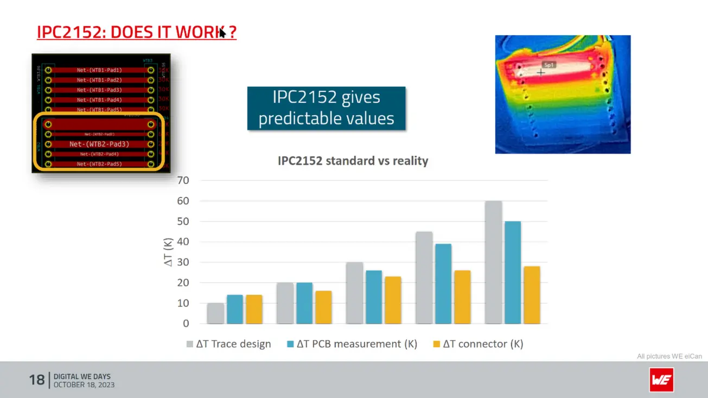

# 线宽与热过孔

在过去，走线宽度、电流和温升的关系通常会引用 [IPC-2221](https://shop.ipc.org/ipc-2221/ipc-2221-standard-only) 标准，但其所用公式基本上是从老旧的 MIL-STD-275 标准抄来的。其没有考虑如底部铺铜、内/外层走线、导线厚度等影响，现已被基于实验测定的 [IPC-2152](https://shop.ipc.org/ipc-2152/ipc-2152-standard-only) 标准替代，因此本文主要基于 IPC-2152 与部分论文及报告编写，不考虑 IPC-2221 中的内容。

需要注意的是，标准测试使用的环境较为理想化，实际中必须进行测试以检查效果。

<figure markdown>
{ width="600" loading=lazy }
</figure>

## 环境假设

IPC-2152 中进行了一些假设：

- 走线相对电路板面积较小，且走线外的电路板面积达 `76.2 x 76.2 mm`
- 电路板厚度在 `1.52 ~ 1.79 mm` 范围内，材质为 `FR4`
- 没有对制造过程中造成的线宽误差进行补偿
- 临近走线在 `25.4 mm` 外，否则需要使用线宽和与电流和

## 走线宽度

标准中提供了大量不同环境与情况下的测试结果图表，但没有提供任何公式，使用时需通过查表找出对应的值。但在实际设计过程中，可以使用各个 EDA 自带的计算工具，也可以使用比较知名的 [Saturn PCB Toolkit](https://saturnpcb.com/saturn-pcb-toolkit/) 的 Conductor Properties 模式，无需手动计算。

> KiCAD 提供的计算器仍在使用 IPC-2221 标准，相关 [issue](https://gitlab.com/kicad/code/kicad/-/issues/2260) 在 2018 年就已提出，但尚未实现，因此建议使用其它工具。

通常而言我们会以 **10℃** 温升作为理想目标，**20℃** 作为绝对目标。但据主导该标准工作的 Mike Jouppi [所说](https://www.youtube.com/watch?v=A4o2MzFRL_U)，根据该标准设计的走线值通常会比实际需要更宽，因此可以在一定范围内缩减线宽，以节约板上空间。

如果无法在单层走线下满足线宽目标，有以下几种办法：

- 通过多层板并联走线，并使用多个过孔平衡各层电流
    - 使用过孔会从各层削掉一部分铜，因此大量使用过孔有可能会导致走线的等效宽度降低，因此使用时需控制数量，或是使用过孔塞铜等工艺（但会显著增加成本）
- 使用焊锡或是铜片/铜排增加导线厚度
    - 需注意使用环境，防止短路或触电
    - 有大量关于焊锡加厚导线的效果和性价比的争论，建议预先进行测试和计算
    - 可能导致成本飙升
- 使用铝基板或主动冷却来加快散热，以提升载流能力

## 热过孔（Thermal Via）

热过孔其实就是普通的过孔，但其作用为通过孔壁铜层快速将热量传导到电路板的背面，协助降低整块 PCB 的热量。在放置热过孔时，需尽量将其放置在地平面，借助内外层的铺铜区快速将热量扩散开，并尽可能靠近热源。

以下内容参考了一项[研究](https://ieeexplore.ieee.org/document/8706634)，其提供了关于热过孔设计的以下几点：

- 在过孔排布上，使用交叉排列可以比矩阵排列增加约 $15.5\%$ 的过孔数量，热阻降为矩阵排列的约 $86.6\%$

    

    { loading=lazy }
    { loading=lazy }
    

- 过孔间距越小，传热越快
    - 需参考厂商可制造性
    - 避免孔距过小造成断裂
    - 避免过度掏空，造成路径电阻增加

- 对于跨板传热，过孔对热量传导的影响最大，板厚、铜厚和层数基本不影响热传导。在长宽方向过孔数一致时，简化的归一化过孔热阻为：

    - $t_{PTH}$：孔壁铜厚
    - $s$：过孔边到边间距
    - $k$：材质的导热系数，单位为 $W/mK$（瓦/米·度）
        - 空气：0.026 W/m·K @ 25°C
        - 铜：393 W/m·K @ 25°C
        - FR4（跨平面）：0.29 W/m·K @ 25°C
        - 塞铜工艺使用的铜浆不是纯铜，需参考厂商提供的值

    $$
    \Theta \approx \frac{2 \sqrt{3} (s + \phi)^{2} k_{FR4}}{4 \pi k_{Cu} t_{PTH} (\phi - t_{PTH}) + \pi k_{filler}(\phi - 2 t_{PTH})^{2}}
    $$

/// marimo-embed
    height: 800px
    mode: read
    include_code: false
    app_width: full

@app.cell
def ui():
    import marimo as mo

    via_dist = mo.ui.number(start=0.1, stop=1000, step=0.1, value=0.2, label='通孔边间距 (mm)：')
    via_thick = mo.ui.number(start=0.0, stop=1000, step=1, value=18, label='孔壁铜厚 (um)：')

    filler_cond = mo.ui.dropdown(
        options={
            '空气': 0.026,
            '环氧树脂': 0.2,
            '铜浆 - JLC': 8,
        },
        value='空气',
        label='填充材质：'
    )

    mo.vstack([via_dist, via_thick, filler_cond])

@app.cell
def calc():
    import math
    import pandas as pd
    import altair as alt

    th_cond_fr4 = 0.29
    th_cond_cu = 393

    def thermal_res(via_width: float, dist: float, thickness: float, cond: float) -> float:
        # mm -> m
        dist /= 1E3
        thickness /= 1E6

        return (2 * math.sqrt(3) * pow(dist + via_width, 2) * th_cond_fr4) / (4 * math.pi * th_cond_cu * thickness * (via_width - thickness) + math.pi * cond * pow(via_width - 2 * thickness, 2))

    points = pd.DataFrame({'Via width': [], 'Thermal resistance': []})

    # 0.1mm ~ 1mm
    for i, width_delta in enumerate(range(0, 951)):
        points.loc[i, 'Via width'] = 0.05 + width_delta * 0.001 # mm
        points.loc[i, 'Thermal resistance'] = thermal_res((0.05 + width_delta * 0.001) * 1E-3, via_dist.value, via_thick.value, filler_cond.value )

    mo.vstack([
        mo.md(text=f'最佳通孔直径：{points['Via width'][points.idxmin()['Thermal resistance']] :.3g} mm'),
        mo.ui.altair_chart(alt.Chart(points).mark_line().encode(x='Via width', y='Thermal resistance'))
    ])

///

## 参考

- [Altium - Using an IPC-2152 Calculator: Designing to Standards](https://resources.altium.com/p/using-ipc-2152-calculator-designing-standards)
- [Lazar Rozenblat - Calculation of PCB trace width based on IPC-2152](https://www.smps.us/pcb-calculator.html)
- [Thermal Modeling and Design Optimization of PCB Vias and Pads](https://ieeexplore.ieee.org/document/8706634)
