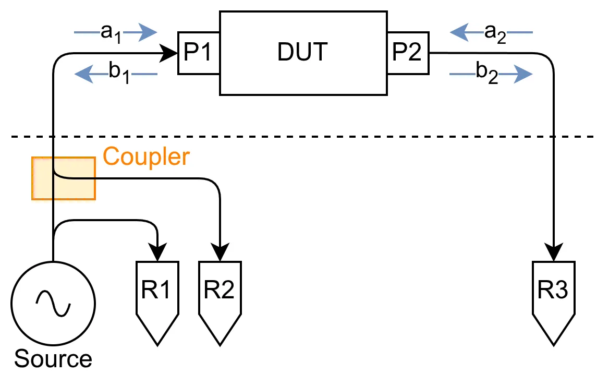
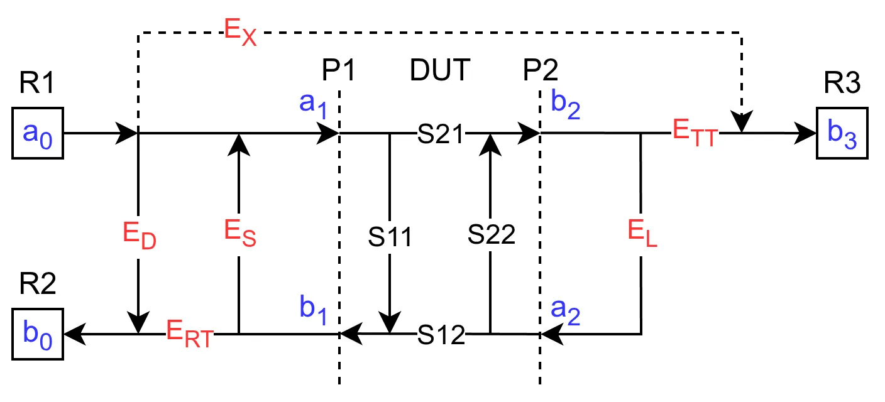

# 三接收器无开关架构网络分析仪

当前业余社区常用的网分仪（如 [NanoVNA](https://github.com/ttrftech/NanoVNA) 和 [LibreVNA](https://github.com/jankae/LibreVNA)）都使用了专业网分仪较少见的三接收器无开关架构。

相较于一般的双端口网分仪，该架构省略了将信号源切换到 P2 端口并测量 $S_{22}$ 所需的一系列元件，因此成本更低。

## 校准

下图为该类型网分仪的简化架构图，虚线代表设备内外分隔：

<figure markdown>

{ width="600" loading=lazy }

</figure>

其中 $R_{1}$ 负责测量输入信号 $a_{1}$，$R_{2}$ 负责测量通过耦合器分离的反向信号 $b_{1}$，$R_{3}$ 负责测量传递信号 $b_{2}$。在理想情况下，可知：

$$
\begin{split}
    S_{11} &= \frac{b_{1}}{a_{1}} = \frac{R_{2}}{R_{1}}\\
    S_{21} &= \frac{b_{2}}{a_{1}} = \frac{R_{3}}{R_{1}}
\end{split}
$$

受架构限制，无法测得 $a_{2}$，故而无法得知 $S_{12}$ 和 $S_{22}$。

但在实际情况下，设备、接口与线材等因素会导致测量结果存在误差，而这种误差可以被看作为网络，并使用误差 S 参数进行表示：

/// admonition | 注意
    type: info

- 虽然图中 $a_{0}$ 代表了信号源输出，但它其实是接收器 $R_{1}$ 对信号源输出的测量结果，实际的源位于 $a_{0} \rightarrow a_{1}$ 这一路径上。
- 计算时将公式化简为 $a_{1}$，DUT 的 S 参数与误差参数的组合，在描述测得 S 参数时就可以将所有 $a_{n}$ 排除掉。
///

<figure markdown>

{ width="800" loading=lazy }

</figure>

| 名称                                                               | 标识     | 定义                                                   |
| ------------------------------------------------------------------ | -------- | ------------------------------------------------------ |
| 方向性误差 （Directivity Error）                                   | $E_{D}$  | 正向的源信号从耦合器泄漏到反向输出                     |
| 串扰误差（Cross talk / Isolation Error）                           | $E_{X}$  | 正向的源信号通过电路板或环境传递到对向，绕过了待测设备 |
| 源端口匹配误差（Source Match Error）                               | $E_{S}$  | 信号由于阻抗匹配误差而在接口 $P_{1}$ 与设备间产生反射  |
| 负载匹配误差（Load Match Error）                                   | $E_{L}$  | 与 $E_{S}$ 类似，但是在 $P_{2}$ 产生反射               |
| 频响反射跟踪误差（Frequency Response Reflection Tracking Error）   | $E_{RT}$ | $R_{1}$ 与 $R_{2}$ 间随频率而变化的误差                |
| 频响传输跟踪误差（Frequency Response Transmission Tracking Error） | $E_{TT}$ | $R_{1}$ 与 $R_{3}$ 间随频率而变化的误差                |

受架构限制，无法对 P2 端口进行校准，因此无法通过校准得出 $E_{X}$。
然而，大部分网分仪的通道间隔离度都很高，所以我们可以忽略 $E_{X}$，对结果的影响不大。

为获得误差的具体值，常使用 SOLT（Short-Open-Load-Through）法进行校准：

- 校准 P1 端口（$S_{21}$，$S_{22}$ 和 $S_{12}$ 不存在）

    1.  短路

        将 P1 端口短路，使得 $S_{11} = -1$（全反射，相移 $180°$），根据图表写出各 $a_{n}$，$b_{n}$ 与输入的关系，整合后得：

        $$
        \begin{split}
            a_{0(Short)} &= a_{1}(1 + E_{S}) \\
            b_{0(Short)} &= a_{1}(E_{D} + E_{D}E_{S} - E_{RT}) \\
            S_{11M(Short)} &= \frac{E_{D} + E_{D}E_{S} - E_{RT}}{1 + E_{S}}
        \end{split}
        $$

    2.  开路

        将 P1 端口开路，使得 $S_{11} = 1$（全反射）：

        $$
        \begin{split}
            a_{0(Open)} &= a_{1}(1 - E_{S}) \\
            b_{0(Open)} &= a_{1}(E_{D} - E_{D}E_{S} + E_{RT}) \\
            S_{11M(Open)} &= \frac{E_{D} - E_{D}E_{S} + E_{RT}}{1 - E_{S}}
        \end{split}
        $$

    3.  负载

        将 P1 端口连接到匹配负载，使得 $S_{11} = 0$（全耗散）：

        $$
        \begin{split}
            a_{0(Load)} &= a_{1} \\
            b_{0(Load)} &= a_{0}E_{D} \\
            S_{11M(Load)} &= E_{D}
        \end{split}
        $$

        结合以上三次 $S_{11M}$ 测量结果可求解出 $E_{D}$，$E_{S}$ 和 $E_{RT}$，即完成对 P1 的校准。

- 直通校准

    将 P1 与 P2 直连，使得 $S_{21} = S_{12} = 1$（完全传输），忽略 $S_{11}$ 和 $S_{22}$（无反射）：

    $$
    \begin{split}
        a_{0(TH)} &= a_{1}(1 - E_{L}E_{S}) \\
        b_{0(TH)} &= a_{1}[E_{D}(1 - E_{L}E_{S}) + E_{L}E_{RT}] \\
        b_{3(TH)} &= a_{1}E_{TT} \\
        S_{11M(TH)} &= \frac{E_{D}(1 - E_{L}E_{S}) + E_{L}E_{RT}}{1 - E_{L}E_{S}} \\
        S_{21M(TH)} &= \frac{E_{TT}}{1 - E_{L}E_{S}}
    \end{split}
    $$

    从而得出 $E_{L}$ 和 $E_{TT}$，完成校准。

## 测量

### 单端口元件

单端口元件只涉及 $S_{11}$，根据图表可知

$$
\begin{split}
    a_{0} &= a_{1}(1 - S_{11}E_{S}) \\
    b_{0} &= a_{1}[E_{D} - S_{11}(E_{D}E_{S} + 1)] \\
    S_{11M} &= \frac{b_{0}}{a_{0}}
            = \frac{E_{D} - S_{11}(E_{D}E_{S} + 1)}{1 - S_{11}E_{S}} \\
    \Rightarrow S_{11} &= \frac{E_{D} - S_{11M}}{E_{D}E_{S} + 1 - S_{11M}E_{S}}
\end{split}
$$

即可得出实际的 $S_{11}$。

### 双端口元件

对于双端口元件，根据图表可知

$$
\begin{split}
    a_{0} &= a_{1}[
            1 - E_{S}
            (S_{11} + \frac{E_{L}S_{12}S_{21}}{1-E_{L}S_{22}})
        ] \\
    b_{0} &= a_{1}[
            E_{D} - (E_{D}E_{S} - E_{RT})
            (S_{11} + \frac{E_{L}S_{12}S_{21}}{1-E_{L}S_{22}})
        ] \\
    b_{3} &= a_{1}\frac{E_{TT}S_{21}}{1 - E_{L}S_{22}}
\end{split}
$$

1.  对称元件

    双端口无源元件属于对称元件，即在理想情况下，其 $S_{11} = S_{22}$，$S_{21} = S_{12}$。
    对于这类元件，只需进行单次测量，然后求解 $S_{11M}$，$S_{21M}$ 二元方程组即可获得其 $S_{11}$，$S_{21}$ 参数。

2.  非对称元件

    对于放大器等主动元件，需要手动将 P1 与 P2 调换进行额外一次反向测量（$S_{11} \leftrightarrow S_{22}$，$S_{21} \leftrightarrow S_{12}$），
    然后求解 $S_{11FM}$，$S_{21FM}$，$S_{11RM}$，$S_{21RM}$ 四元方程组，即可获得完整的 S 参数。

---

## 参考

- [Keysight - Measurement Errors](https://helpfiles.keysight.com/csg/N1930xB/VNACalAndMeas/Errors.htm)
-  [National Instruments - Error Models](https://www.ni.com/docs/zh-CN/bundle/rfmx-vna/page/error-models.html)

## 示例

- [使用 NanoVNA-F V2 进行测量和校准](https://github.com/ResRipper/NanoVNA-F_V2-Collector)