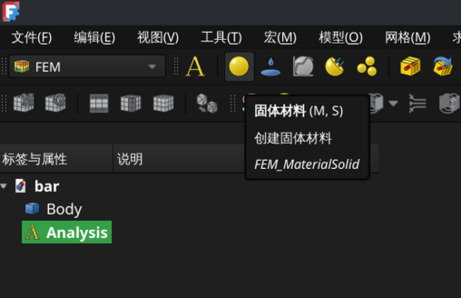
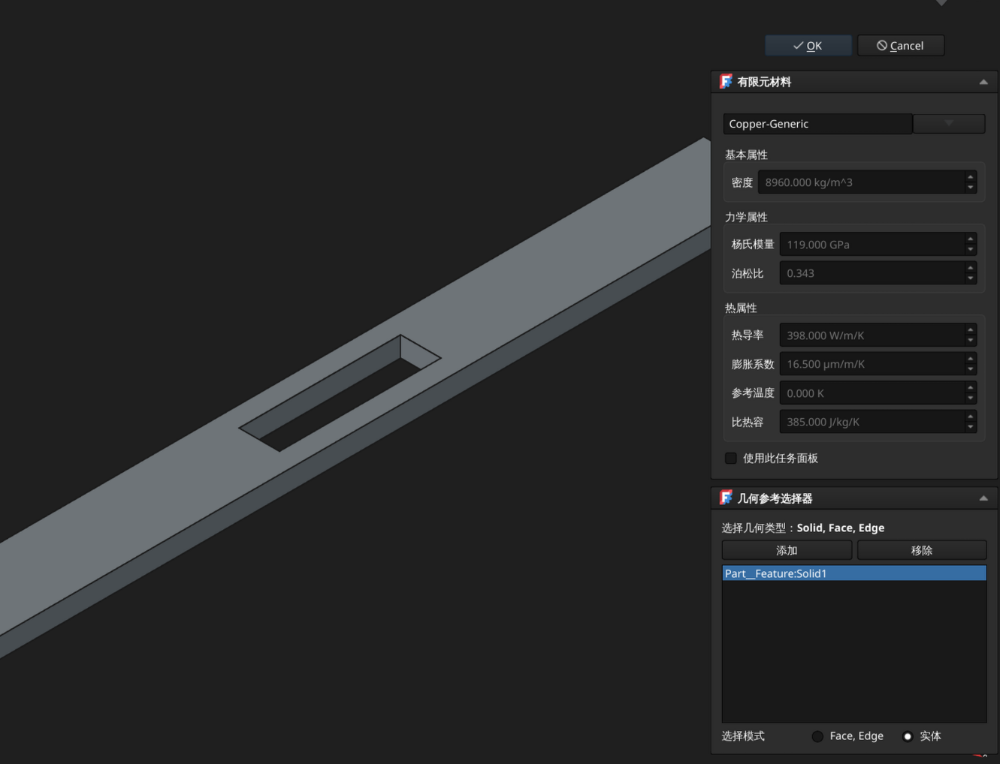
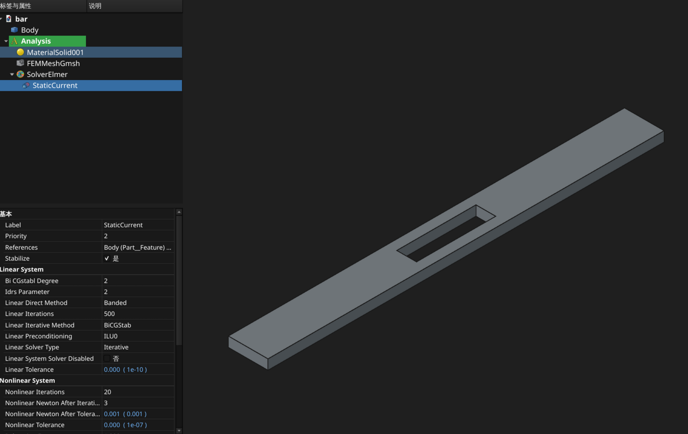
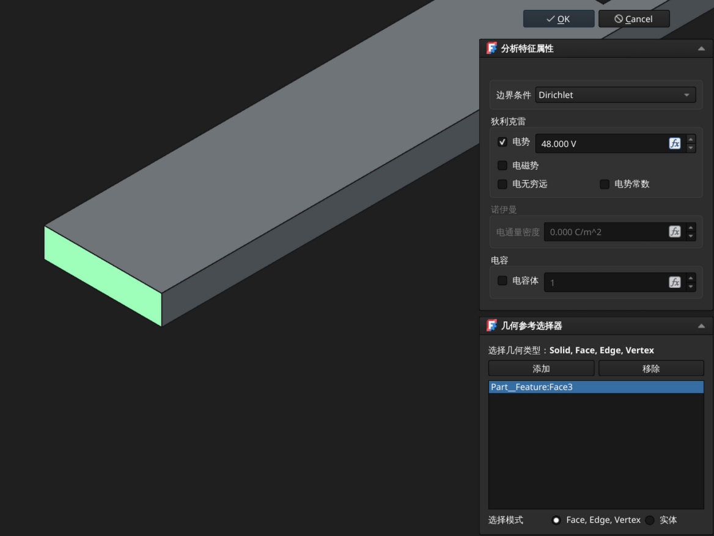
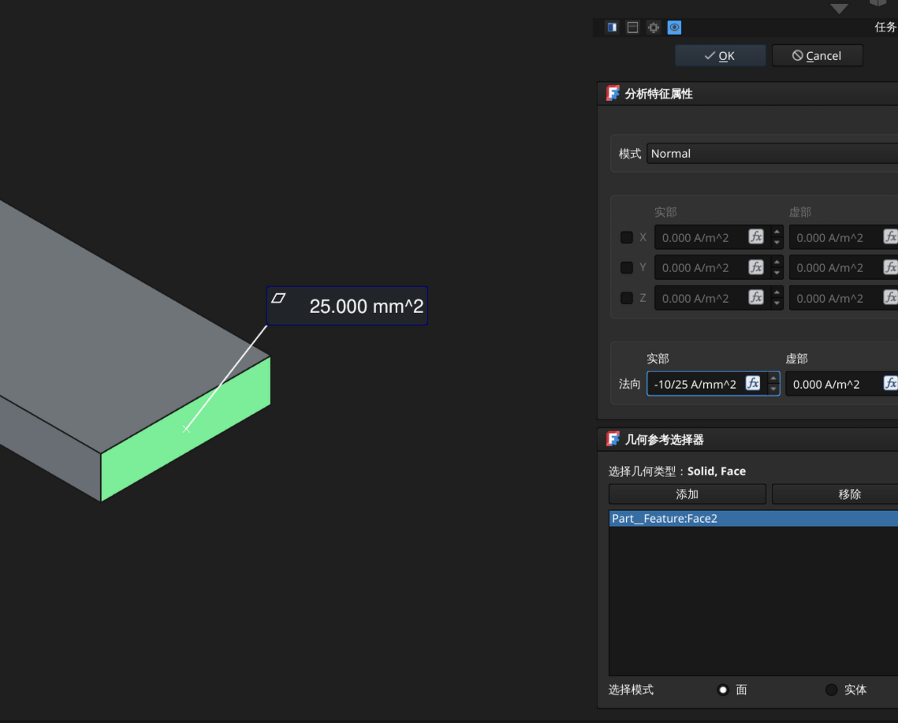
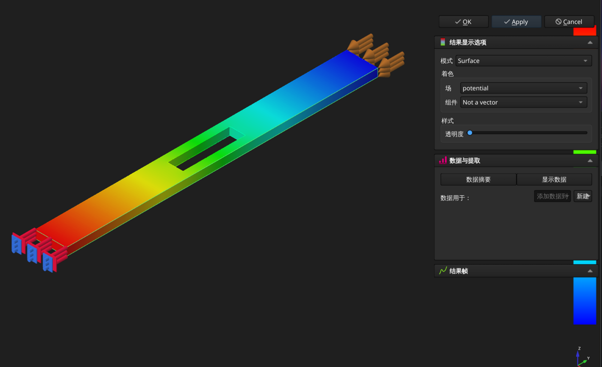
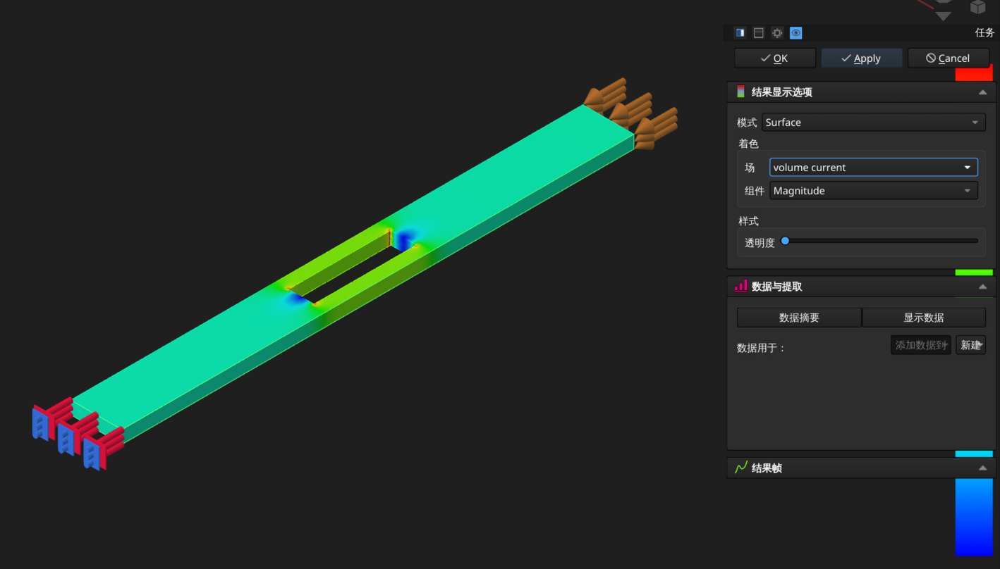

<!--
 Copyright 2026 ResRipper.
 SPDX-License-Identifier: Apache-2.0
-->

# FreeCAD 静态电流仿真

/// admonition | 结果无数据
    type: warning

对于较为复杂的模型（例如从 KiCAD 直接导出的电源网络模型），在 FreeCAD 上进行该仿真可能会出现结果数据全为 0 的情况，该问题似乎是由网格存在畸变（negative jacobians）导致的，但 ElmerFEM 不会产生任何警告或报错。

该问题可能是由 ElmerFEM 或其依赖导致的，并确认在 2026/04/03 及以后的 Windows Nightly 版本的 ElmerFEM 上已被修复，但在 Linux 上从[最新](https://github.com/ElmerCSC/elmerfem/commit/7b073597d1c1df84367f1dfaa44972306643a311)提交构建时仍存在该问题。

因此，如果你碰到了该问题，建议进行以下操作：

- 在 Windows 平台上使用[最新](http://www.nic.funet.fi/pub/sci/physics/elmer/bin/windows)的 Nightly 版本
- 在 Linux 平台上确保网格化时没有出现任何警告
    - 使用 Netgen 网格器或 Gmsh 的 Netgen 优化器选项时可能不会对网格问题进行告警

///

/// admonition | 仿真直接中断
    type: warning

ElmerFEM 26.1 版本中的 ElmerGrid 在将 unv 格式网格（即 FreeCAD 使用的格式）转换为 ElmerSolver 可用的格式时会闪退，该问题[已被修复](https://github.com/ElmerCSC/elmerfem/commit/85e16d005de298691faeeeaccde685fe5bac4da1)，请在 Windows 上使用 [Nightly](http://www.nic.funet.fi/pub/sci/physics/elmer/bin/windows) 版本的 ElmerFEM，在 Linux 上自行从源码构建。

///

FreeCAD 在 1.1 版本中添加了基于 ElmerFEM 的静态电流仿真支持，使仿真流程变得简单了很多。

本文假设对一条铜排进行仿真，条件为：

- 输入电压：48V
- 输入电流：10A

## 材料、网格与方程配置

1. 将模型拖入 FreeCAD，创建一个仿真容器

2. 为模型分配材料，选择 `Copper-Generic`（纯铜），然后以实体模式将其应用到模型

    

    { width="800" loading=lazy }
    { width="800" loading=lazy }
    

3. 选中模型，创建网格对象，生成网格
4. 创建 Elmer 求解器对象，然后选中刚创建的求解器对象，添加静态电流方程

    

    { width="800" loading=lazy }
    

5. 双击创建的方程，然后将模型实体添加到方程

## 边界条件

1. 选中求解器对象，然后添加静电势边界条件，配置输入电压

    - 边界条件类型：Dirichlet
    - 电势：48V

    然后添加电压输入面

    

    { width="800" loading=lazy }
    

2. 选中求解器对象，然后添加电流密度边界条件，配置输入电流

    - 模式：Normal
    - 密度值为负，代表从该面输出
    - 求解器只接受电流密度作为参数，可以使用测量工具获得面积，然后在输入框中直接计算，不用手动将单位转换为 `A/m^2`

    然后添加电流输出面

    

    { width="800" loading=lazy }
    

## 仿真

- 双击求解器对象，在任务面板中选择 `Apply` 进行求解

- 结果包含在 `SolverElmerResult` 对象中，将其导出后可在 Paraview 等软件中进一步进行分析。

{ width="800" loading=lazy }
{ width="800" loading=lazy }

## 工程文件

- [bar.FCStd](./assets/freecad_current/bar.FCStd)
- [bar.step](./assets/freecad_current/bar.step)